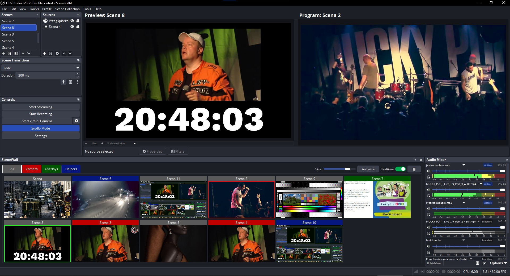

# SceneWall

**SceneWall brings the vMix multiview idea to OBS Studio** — a dockable panel where every scene becomes a live thumbnail you can switch with a single click. It started as a port of vMix's source list, but it is not a clone: SceneWall adds features vMix's source list does not offer, such as fully user-defined tab groups with custom colors, per-scene headers, collapsible scene bars, a wrapping (flex-like) layout, one-click *Autosize*, and full localization.



> **Note about the screenshot:** the middle toolbar that normally sits between the *Preview* and *Program* views is not visible here, because the author runs the companion plugin **[studio-no-transition-strip](https://github.com/studiokrause/studio-no-transition-strip)**, which moves OBS's transition strip (Transition button, T-bar and quick transitions) into a movable dock.

## What it is

SceneWall is a dock panel for OBS Studio. It shows all scenes of the current scene collection as live thumbnails, arranged in a wrapping grid that reflows to the width of the dock. It is meant as a fast, visual switcher for operators who work with many scenes (cameras, overlays, helpers) and want to see them all at once — similar to a video switcher's multiview.

Unlike vMix's source list, SceneWall lets you organize scenes into **named tab groups with their own colors**, rename the special **All** tab, collapse individual scenes into compact vertical bars, and resize everything with one slider or a single *Autosize* click.

## Features

- **Live scene thumbnails** rendered by libobs, refreshed continuously.
- **Wrapping layout** — thumbnails (and collapsed bars) reflow like a flex container when the dock is resized.
- **Autosize** — computes the largest thumbnail size that still fits every scene in the visible dock area.
- **Realtime mode** — optional high-frequency thumbnail refresh (with a resource-usage warning).
- **Tab groups with colors** — create, rename, recolor and remove tabs; each tab's color is used for its scene headers and the tab button itself.
- **Scene assignment** — assign any scene to a tab; assignments are stored by stable IDs, so renaming a tab never loses them.
- **Scene headers** — every scene has a header with white text and a configurable background color; right-click it to collapse the scene into a vertical bar (click the bar to expand again).
- **Program / Preview indicators** — red frame for the current Program scene, green frame for the current Preview scene in Studio Mode.
- **Combined context menu** — OBS scene actions and SceneWall actions in one menu, opened with **CTRL + click**.
- **Localization** — English, German, Polish, Ukrainian, Italian, Spanish and French, following OBS's interface language.

## Using SceneWall

### Mouse and keyboard

- **Left click** on a thumbnail — switch to that scene (set it as the current Program scene).
- **Right click (PPM)** on a thumbnail — in **Studio Mode** sets the scene as the Preview scene. Outside Studio Mode it does nothing, so a plain right-click never opens a menu.
- **CTRL + click** on a thumbnail — opens the **combined context menu**:
  - *Rename...*, *Duplicate*, *Remove* — standard scene operations.
  - *Filters*, *Properties* — open the scene's filters and properties.
  - *Assign to Tab* — put the scene in one of your tab groups.
  - *Collapse* / *Expand* — collapse the scene into a vertical bar or expand it back.
- **Right click on a scene header** — collapse that scene into a vertical bar.
- **Left click on a collapsed bar** — expand the scene again.

### Autosize

Click **Autosize** in the toolbar to let SceneWall pick the largest thumbnail size that fits every scene of the current tab inside the visible dock area. Collapsed bars are taken into account (they are narrower than full thumbnails), so Autosize packs the layout efficiently.

### Realtime

The **Realtime** toggle switches thumbnails to a high refresh rate. Because this can noticeably increase CPU/GPU usage, OBS shows a confirmation warning the first time you enable it. Leave it off for everyday use; turn it on when you need near-instant visual feedback.

### Tabs and scene assignment

- The **All** tab always shows every scene. Its title can be renamed like any other tab, and on first run it uses the current OBS interface language.
- Create, rename, recolor and remove tabs in **Settings** (the gear button). Clicking a color cell opens a color picker.
- To put a scene in a group, **CTRL + click** it and choose *Assign to Tab*. A scene can belong to one tab; unassigned scenes appear only in **All**.
- Assignments are keyed by a **stable tab ID**, so changing a tab's name keeps all of its scenes. Deleting a tab returns its scenes to **All**.

### Scene headers and bars

Each thumbnail has a header showing the scene name in white on the tab's color. Right-clicking the header collapses the scene into a slim vertical bar (with the name rotated); clicking the bar expands it again. This is handy for keeping rarely used scenes around without wasting space.

## Installation

1. Copy `SceneWall.dll` to `OBS_FOLDER/obs-plugins/64bit/`.
2. Copy the contents of `data/obs-plugins/SceneWall/` (the `locale` folder) to `OBS_FOLDER/data/obs-plugins/SceneWall/`.
3. Restart OBS Studio.

SceneWall uses only libraries shipped with OBS (`obs.dll`, `obs-frontend-api.dll`, Qt6).

## Building from source

Requirements:

- Windows 10/11 x64, Visual Studio 2019/2022 (MSVC, x64).
- CMake 3.16+.
- An installed OBS SDK (headers + import libraries) — e.g. from the OBS Studio source tree.
- A Qt6 build (CMake package) — e.g. the `obs-deps` Qt6 package.

Configure and build, pointing CMake at your SDK and Qt6:

```powershell
cmake -S . -B build -DOBS_SDK_DIR="C:/path/to/obs-sdk-installed" -DOBS_QT_DIR="C:/path/to/qt6/lib/cmake/Qt6"
cmake --build build --config Release
```

The resulting `build/Release/SceneWall.dll` is the plugin.

## Localization

All user-facing strings go through OBS's translation mechanism (`obs_module_text`). Translation files live in `data/obs-plugins/SceneWall/locale/*.ini` and follow the OBS interface language. Currently included: **en-US, de-DE, pl-PL, uk-UA, it-IT, es-ES, fr-FR**. Contributions for more languages are welcome.

## Versioning

The current version is **0.1**. From this release on, every new build increments the version by **0.1** (`0.1`, `0.2`, `0.3`, ...). The version is defined once in `CMakeLists.txt` (`project(SceneWall VERSION ...)`) and shown in the plugin's *About* dialog.

## License

SceneWall is **free and open-source software (FOSS)**, released under the **MIT License**. See [LICENSE](LICENSE). You are free to use, study, modify and redistribute it, including commercially, as long as the copyright notice and license text are preserved.

## Credits

- Author: **studiokrause**
- Development assisted by AI models (OpenCode, Gemini).
- Companion plugin: [studio-no-transition-strip](https://github.com/studiokrause/studio-no-transition-strip).
