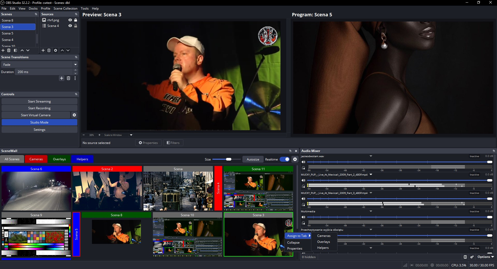

# SceneWall

**SceneWall is a port of vMix's source list to OBS Studio** — a dockable panel where every scene becomes a live thumbnail you can switch with a single click.

All of the functionality is taken from vMix: live thumbnails, tab groups with colors, collapsible scene bars, a wrapping (flex-like) layout, Program/Preview indicators and the surrounding mouse interactions. SceneWall adds only three things of its own:

- **Size / Autosize** — a thumbnail size slider plus one-click Autosize
- **Realtime** — a toggle for high-frequency thumbnail refresh
- **Naming and reordering tabs** — the ability to name tabs and change their order



> **Note about the screenshot:** the middle toolbar that normally sits between the *Preview* and *Program* views is not visible here, because the author runs the companion plugin **[studio-no-transition-strip](https://github.com/studiokrause/studio-no-transition-strip)**, which moves OBS's transition strip (Transition button, T-bar and quick transitions) into a movable dock.

## What it is

A dock panel that shows the scenes of the current scene collection as live thumbnails in a wrapping grid that reflows to the width of the dock. Built for operators who work with many scenes (cameras, overlays, helpers) and want to see them all at once — similar to a video switcher's multiview.

Scenes can be collapsed into compact vertical bars and the grid reflows as the dock is resized. On top of the vMix behaviour, the thumbnail size can be set with a slider or with a single *Autosize* click.

## Features

Everything below mirrors vMix's source list. The three items marked **(added by SceneWall)** are the ones SceneWall contributes on top of the port.

### Thumbnails and layout

- **Live scene thumbnails** rendered through the OBS graphics subsystem.
- **Wrapping layout** — thumbnails and collapsed bars reflow like a flex container when the dock is resized.
- **Autosize** **(added by SceneWall)** — computes the largest size that fits every scene of the current tab in the visible area, then applies it to all tabs. Collapsed bars count as narrower, so packing stays efficient.
- **Realtime mode** **(added by SceneWall)** — refreshes at the frame rate OBS is currently running at, after a resource-usage confirmation.
- **Optimized rendering** — GPU scratch buffers are allocated once per thumbnail and reused, and anything not actually visible (hidden dock, other tab, scrolled out of view) is skipped entirely.

### Tabs and scenes

- **Tab groups with colors** used for the tab buttons and for the headers of the scenes assigned to them.
- **Scene assignment** keyed by a **stable tab ID**, so renaming or reordering a tab never loses its scenes.
- **Naming and reordering tabs** **(added by SceneWall)** — tabs can be named and their order changed by dragging a tab button to a new position; both are saved between sessions.
- **Drag & drop reordering of scenes** — drag a thumbnail inside a tab to reorder it. Each tab keeps its own order, completely independent of the scene list in OBS. Saved between sessions.

### Scene headers and indicators

- **Scene headers** with white text on a configurable background color. Right-click a header to collapse the scene into a slim vertical bar; right-click again to expand it.
- **Thumbnail frames** — every thumbnail is outlined with a thin 1px grey frame so scenes are visually separated. The active scene stands out with a thicker frame: red for the current Program scene, green for the current Preview scene in Studio Mode.
- **Localization** — English, German, Polish, Ukrainian, Italian, Spanish and French. The default title of the **All** tab is translated too.

## Mouse and keyboard

| Action | Result |
| --- | --- |
| **Left click** on a thumbnail | Switch to that scene |
| **Left drag** on a thumbnail | Reorder it inside the current tab |
| **Right click** on a scene header | Collapse / expand that scene |
| **Right click** on a thumbnail | In Studio Mode, set it as the Preview scene. A plain right-click never opens a menu |
| **CTRL + click** on a thumbnail | Plugin menu: *Assign to Tab*, *Remove from Tab*, *Collapse / Expand*, *Properties* |

## Tabs and assignment

- The **All** tab always shows every scene. Its title can be renamed and it cannot be deleted. On first run it uses the OBS interface language.
- Create, rename, recolor and remove tabs in **Settings** (the gear button). Clicking a color cell opens a color picker.
- To put a scene in a group, **CTRL + click** it and choose *Assign to Tab*. A scene belongs to one tab; unassigned scenes appear only in **All**.
- A scene's header takes the color of the tab it is **assigned** to, so its group stays recognisable even while browsing **All**.

## Installation

1. Copy `SceneWall.dll` to `OBS_FOLDER/obs-plugins/64bit/`
2. Copy the `locale` folder to `OBS_FOLDER/data/obs-plugins/SceneWall/`
3. Restart OBS Studio

SceneWall uses only libraries shipped with OBS (`obs.dll`, `obs-frontend-api.dll`, Qt6).

## Building from source

Requirements: Windows 10/11 x64, Visual Studio 2019/2022 (MSVC x64), CMake 3.16+, an installed OBS SDK and a Qt6 CMake package. The paths are set at the top of `CMakeLists.txt`:

```powershell
cmake -S . -B build
cmake --build build --config Release
```

The resulting `build/Release/SceneWall.dll` is the plugin.

## Version

The current version is **1.2**.

## License

MIT License

Copyright (c) 2026 Studio Krause

Permission is hereby granted, free of charge, to any person obtaining a copy of this software and associated documentation files (the "Software"), to deal in the Software without restriction, including without limitation the rights to use, copy, modify, merge, publish, distribute, sublicense, and/or sell copies of the Software, and to permit persons to whom the Software is furnished to do so, subject to the following conditions:

The above copyright notice and this permission notice shall be included in all copies or substantial portions of the Software.

THE SOFTWARE IS PROVIDED "AS IS", WITHOUT WARRANTY OF ANY KIND, EXPRESS OR IMPLIED, INCLUDING BUT NOT LIMITED TO THE WARRANTIES OF MERCHANTABILITY, FITNESS FOR A PARTICULAR PURPOSE AND NONINFRINGEMENT. IN NO EVENT SHALL THE AUTHORS OR COPYRIGHT HOLDERS BE LIABLE FOR ANY CLAIM, DAMAGES OR OTHER LIABILITY, WHETHER IN AN ACTION OF CONTRACT, TORT OR OTHERWISE, ARISING FROM, OUT OF OR IN CONNECTION WITH THE SOFTWARE OR THE USE OR OTHER DEALINGS IN THE SOFTWARE.

## Credits

- **Author:** Studio Krause
- **Model / development:** Tencent Hy4 Preview
- **Companion plugin:** [studio-no-transition-strip](https://github.com/studiokrause/studio-no-transition-strip)
